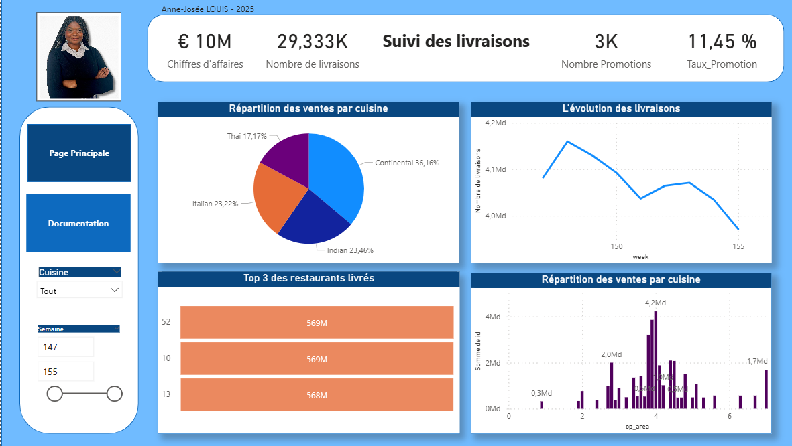
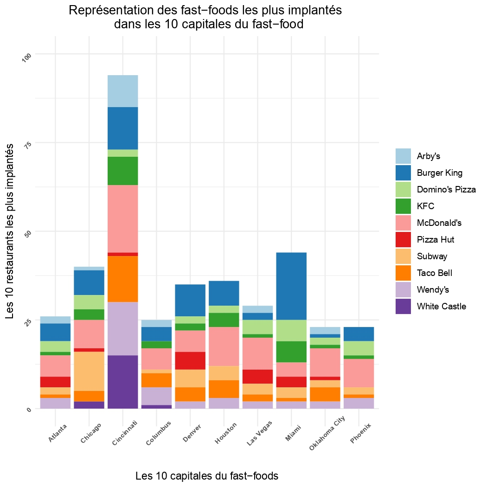

# Anne-Josée LOUIS — Data Analyst | Data Scientist 

🎯 **Transformer les données en leviers de confiance, de compréhension et de décision**

---

## 👋 À propos de moi  

Je suis **Data Analyst basée à Paris**, passionnée par la **qualité, la visualisation** et la **valorisation des données**.  
Mon objectif : faire parler les données pour **améliorer les processus**, **fiabiliser les systèmes d’information** et **aider les équipes métiers à piloter plus efficacement**.

💼 En alternance à la **RIVP**, j’ai travaillé sur la **fiabilisation des données ERP**, le **matching de chaînes** et l’**automatisation de contrôles de cohérence** sous Python et Excel.  
💡 En parallèle, je contribue à des **projets à impact social**, comme la création d’**outils éducatifs inclusifs** pour l’association *Tous Inclus*.  

---

## 🧰 Compétences techniques  

| Domaine | Outils & Technologies |
|----------|------------------------|
| **Langages** | Python (Pandas, Numpy, Matplotlib), SQL, R |
| **DataViz** | Power BI (DAX, M, PowerQuery), Excel avancé (TCD, VBA) |
| **Data Engineering** | Databricks, Azure, gestion de fichiers CSV et bases SQL |
| **Méthodes** | Nettoyage, fiabilisation, matching (Levenshtein), analyse descriptive, modélisation |
| **Transverses** | Documentation, vulgarisation, transfert de compétences |

---

## 📂 Projets présentés ici  

📈 **Suivi des livraisons avec PowerBI**  
  Tableau de bord
  

  

📂 [Télécharger le rapport Power BI (PBIX)](fichier/rapport_supply.pbix)

📊 **Analyse des Fast-Foods dans les 10 plus grandes villes**

Ce projet présente une analyse exploratoire des enseignes de fast-food les plus implantées dans 10 grandes villes des États-Unis.  
Les données ont été traitées avec **R** et visualisées avec **ggplot2**.

---

## 📁 Fichiers du projet

- 📜 **Script R principal** : [`analyse_fast_food.R`](fichier/analyse_fast_food.R)  
  Contient le code d’extraction, de filtrage et de visualisation des données.

- 📄 **Graphique** :
  

  

---

## 🎓 Parcours  

🎓 **Master Informatique & Management – Spécialité IA**  
*Ionis-STM, Paris – 2025*  

🎓 **Licence MIASHS (Mathématiques et Informatique Appliquées)**  
*Université Paris 1 Panthéon-Sorbonne – 2022*  

---

## 💬 Ce que j’aime dans la data  

- 🔍 Rendre les données **fiables et accessibles** à tous  
- 📊 Créer des **dashboards clairs et esthétiques**  
- 🧩 **Vulgariser** les analyses pour les équipes non techniques  
- 🤝 Travailler dans un esprit **pédagogique et collaboratif**

---

## 🌐 Me contacter  

📧 [annejosee.louis@gmail.com](mailto:annejosee.louis@gmail.com)  
💼 [LinkedIn – Anne-Josée LOUIS](https://www.linkedin.com/in/anne-josee-louis)  

---
✨ *« La donnée n’a de valeur que si elle éclaire les décisions et rapproche les personnes. »*  
